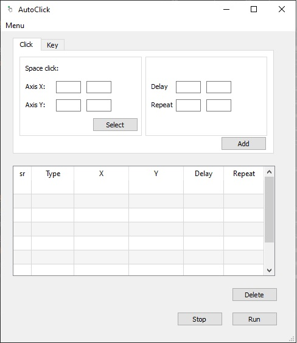

<h2 align="center">
 AutoClick :computer_mouse:
</h2>

	

> Status do Projeto: Em desenvolvimento :man_technologist: 

<h2>:dart:Objetivo</h2>
Desenvolver um auto-click para automatização de atividades repetitivas.
<h2>:keyboard: Funcionalidades</h2>

:heavy_check_mark:Single Left Click

:heavy_check_mark:Key Press

<h2> :hammer_and_wrench:Tecnologias </h2>

- Python
- PyQt5
- PyAutoGui

